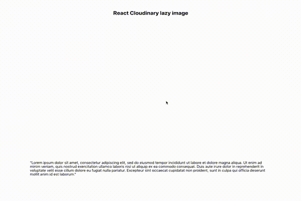

# react-cloudinary-lazy-image

Optimised images with Cloudinary.

'react-cloudinary-lazy-image' is React component which cover "blur-up" effect, lazy-loading and formatting.
The component is based on [Gatsby image](https://github.com/gatsbyjs/gatsby/blob/master/packages/gatsby-image) by Kyle Mathew,
however instead of GraphQL and Gatsby it uses Cloudinary API. Have a speed and optimized gatsby-images without gatsby.



## Covers

1) Downsize larger images to the size needed by your design - even on desktop there is no need to get as big image as possible.
2) Remove metadata from delivered images - by default images contain a lot of information useful for cameras and graphics applications, but not for web users.
3) Format images to newer formats like JPEG-XR and WebP - common formats like PNG, JPG or GIF are not optimised to be send wireless.
4) Lower image quality - many images have extra-high resolution, however it’s possible to lower quality without a significant visual impact.
5) Downsize images on smaller device - display images for mobile users faster as there is probably slower internet connection.
6) Lazy load images - allow images to download only when user scroll to it allows to speed up initial page load.
7) Hold position of element -  page doesn’t jump while images load.
8) “Blur-up” technique - show very low resolution image before the original loads.

Points 1-4 are handled by Cloudinary.

# Install

`npm install react-cloudinary-lazy-image --save`

## How to use

Fixed example:
```jsx
import React from 'react'
import Img from 'react-cloudinary-lazy-image'

export default ({publicId}) => (
    <div>
        <h1>Lazy-image with Cloudinary</h1>
        
    </div>
)
```

Fluid example:
```jsx
import React from 'react'
import Img from 'react-cloudinary-lazy-image'

export default ({publicId}) => (
    <div>
        <h1>Lazy-image with Cloudinary</h1>
        
    </div>
)
```

## Two types

Same as in gatsby-image there are two types of responsive images. _Fixed_ and _fluid_.
1. Images with _fixed_ height and width. Cover double pixel density for retina display.
2. Images in _fluid_ container. Takes smallest possible picture to fill container. Configurable step allow you to have control over breakpoints.


## Image transformation

You can set image transformation according to Cloudinary [documentation](https://cloudinary.com/documentation/image_transformation_reference),
by setting `urlParams`. You can also find all formats that can be passed to `imgFormat` prop or get more info about `quality` prop.


## Props

| Name                   | Type                | Description                                                                                                                                          |
| ---------------------- | ------------------- | -----------------------------------------------------------------------------------------------------------------------------------------------------|
| `fixed`                | `object`            | Object with 'width' and 'height' properties                                                                                                          |
| `fluid`                | `object`            | Object with 'maxWidth' required property. Optionally step, _default_=150 and 'height'. If height not set, uses 'c_scale' otherwise 'c_lfill'         |
| `fadeIn`               | `bool`              | Defaults to fading in the image on load                                                                                                              |
| `cloudName`            | `string`            | Cloudinary cloud name, _default_=process.env.CLOUD_NAME or process.env.REACT_APP_CLOUD_NAME                                                          |
| `imageName`            | `string`            | Cloudinary publicId                                                                                                                                  |
| `urlParams`            | `string`            | Cloudinary image transformations params. Overrides default 'c_lfill' or 'c_scale'                                                                    |
| `title`                | `string`            | Passed to the `img` element                                                                                                                          |
| `alt`                  | `string`            | Passed to the `img` element                                                                                                                          |
| `style`                | `object`            | Spread into the default styles of the wrapper element                                                                                                |
| `imgStyle`             | `object`            | Spread into the default styles of the actual `img` element                                                                                           |
| `placeholderStyle`     | `object`            | Spread into the default styles of the placeholder `img` element                                                                                      |
| `backgroundColor`      | `string` / `bool`   | Set a colored background placeholder instead of "blur-up". If true, uses _default_ "lightgray" color. You can also pass in any valid color string.   |
| `onLoad`               | `func`              | A callback that is called when the full-size image has loaded.                                                                                       |
| `onError`              | `func`              | A callback that is called when the image fails to load.                                                                                              |
| `imgFormat`            | `string` / `bool`   | Allow Cloudinary to format image. By default is set to 'f_auto'. Can be switch off by passing 'false' or be formatted to specific format (ex. 'webp')|
| `quality`              | `string` / `bool`   | Allow Cloudinary to change quality of image. By default is set to 'q_auto'. Can be switch off by passing 'false' or to specific value (ex. 'best')   |


